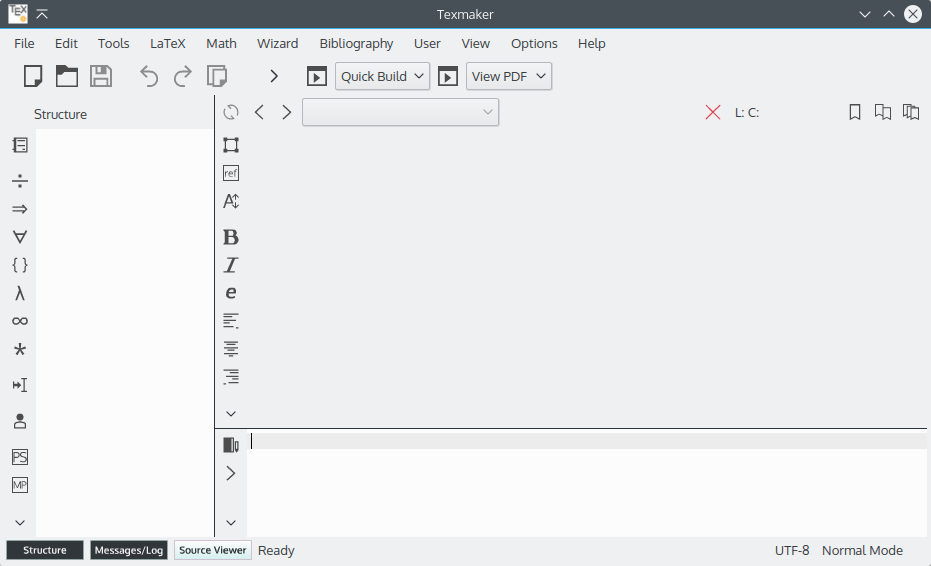
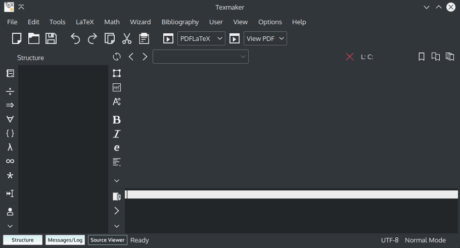
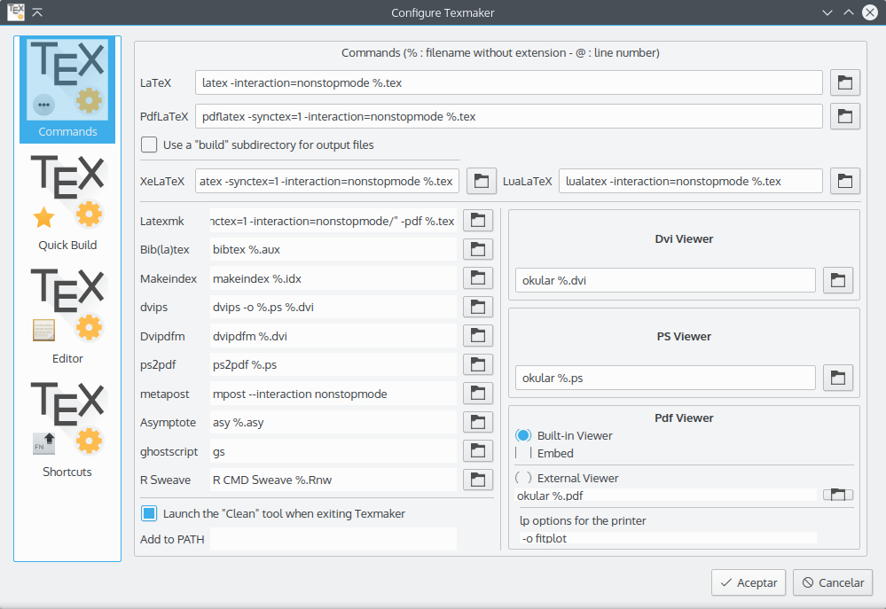
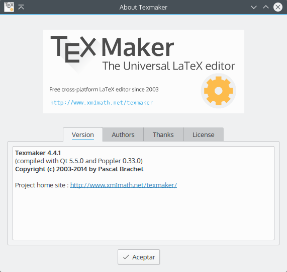

# texmaker-breeze
 An attempt to integrate Texmaker with Breeze, the default visual style in KDE Plasma 5.x.

## Installation
You need to compile/re-compile Texmaker to apply this icon pack. If you're on Arch Linux, you can use the PKGBUILD in the "Arch" directory. Just download the sources, open a terminal at the right folder and run
```bash
makepkg -s
```
Optionally, you can use the Dark variant to match the Breeze-Dark style. If you want to try it on Arch Linux, just change the line 26 of the PKGBUILD:
```bash
cp -f $srcdir/$pkgname-master/images/breeze/* "$srcdir/$_pkgname-$pkgver/images/"
```
To this:
```bash
cp -f $srcdir/$pkgname-master/images/breeze-dark/* "$srcdir/$_pkgname-$pkgver/images/"
```
(Yes, just add '-dark' after 'breeze')

Additionally, if you don't want to compile the packages yourself, you can download the TAR.XZ packages from [HERE](http://opendesktop.org/content/show.php?content=171234).

## Disclaimer
I took as many original icons from "Breeze" as I could. Those who are not part of the official set, including the Texmaker icon, were made using Inkscape®.
Therefore, all the icons that I didn't create, are licensed under the LGPL.

## Screenshots



